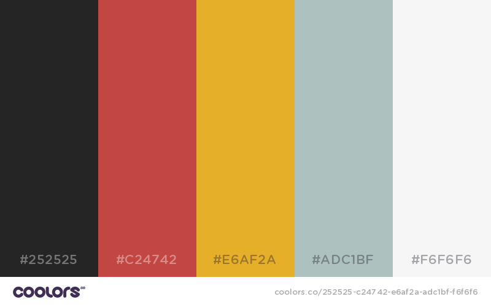

# Proyecto unbiciclista
Página estática alojada en github y la cual está abierta a colaboraciones de mejora del código como de traducción del contenido.


## Colores ##
La paleta de colores de esta página es https://coolors.co/app/252525-c24742-e6af2a-70bd5b-f6f6f6
```sass
/* Coolors Exported Palette - coolors.co/252525-c24742-e6af2a-70bd5b-f6f6f6 */

$color1: #252525; //rgba(37, 37, 37, 100)
$color2: #c24742; //rgba(194, 71, 66, 100)
$color3: #e6af2a; //rgba(230, 175, 42, 100)
$color4: #70bd5b; //rgba(112, 189, 91, 100)
$color5: #f6f6f6; //rgba(246, 246, 246, 100)
```


##Gracias a .. ##
Hay mucho software por ahí muy bueno y sencillo de utilizar. Para este site he usado los siguientes scripts o librerías.

1. Fotos obtenidas de unsplash en [https://unsplash.com](https://unsplash.com)
2. Para los iconos de las librías y todo ese material, el estupendo respositorio de [T1st3]( https://github.com/T1st3/vendor-icons)
